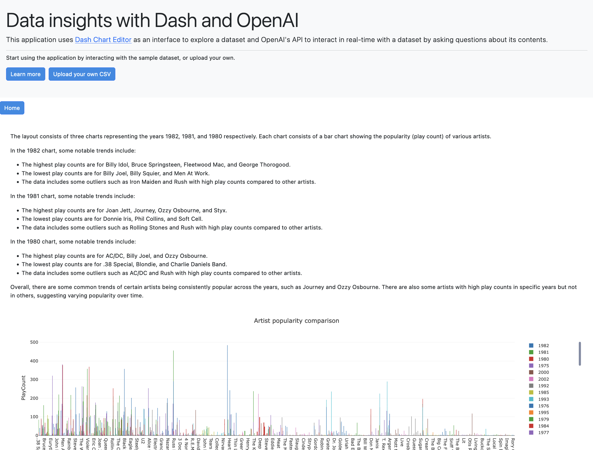

# All in AI Demo App
A demo app for the [All in AI](https://allinevent.ai/) presentation on September 27, 2023.

Developed & presented by Nathan Drezner ([@ndrezn](https://github.com/ndrezn)).


https://github.com/plotly/all-in-ai-demo-app/assets/32049495/35f40db8-e83d-4ad7-af9b-a9390f696bde


This application uses [Dash Chart Editor](https://github.com/BSd3v/dash-chart-editor) and the [OpenAI Python library](https://github.com/openai/openai-python) to build an application allowing users to ask questions about a dataset and persist views of their dataset with analytics associated.

Once a dataset is uploaded, context on that dataset is added to the prompt for the chat window, and users can interact with the dataset with natural language. After building charts, users can click the "Copy link" button to save those charts to a permanent link, using Redis to save state.

<p align="center">
    
</p>


## Usage
> Note: You must provide an [OpenAI API key](https://platform.openai.com/account/api-keys) as an environment variable at `$OPEN_AI_KEY`.

Install the dependencies with:
```
pip install -r requirements.txt
```

And run the application with:
```
python app.py
```

Or, provide your API key directly if it is not in your environment:
```
OPEN_AI_KEY=... python app.py
```
